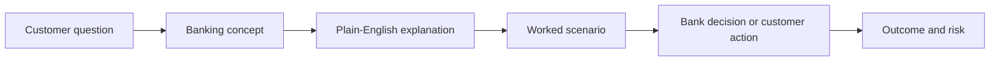

# how-mcp-works

`how-mcp-works` is a visual, interactive learning repository for the fundamentals of banking. It combines a tiny GPT-style educational model, visual documentation, and a Streamlit interface so beginners can learn banking through simple explanations and worked scenarios.

The project stays small enough for beginners to follow, and the learning content now focuses on:

- checking and savings accounts
- deposits and withdrawals
- interest and repayment
- loans and credit risk
- liquidity and reserves
- payment flows
- beginner-friendly scenario analysis

## What You Get

- A clean PyTorch implementation of a mini GPT-style character model
- A full data preparation, training, evaluation, and inference pipeline
- A Streamlit app to explore banking concepts, example scenarios, and generated explanations
- Visual-first documentation with diagrams that explain how core banking flows work
- Tests for core behavior

## Quickstart

### 1. Create an environment

```bash
python -m venv .venv
.venv\Scripts\activate
pip install -e .[dev]
```

### 2. Train the tiny model

```bash
python -m scripts.train --steps 300 --eval-interval 50
```

This trains on the bundled educational corpus and writes artifacts to `artifacts/`.

### 3. Generate text

```bash
python -m scripts.generate --prompt "banking concept: savings account" --max-new-tokens 120
```

### 4. Launch the visual demo

```bash
streamlit run streamlit_app.py
```

## Repository Map

- `src/how_mcp_works/`
  Core package with config, tokenizer, dataset utilities, model, trainer, and inference helpers.
- `scripts/`
  CLI entry points for preparing data, training, and generation.
- `docs/`
  Visual-first explanations, architecture notes, and Mermaid diagrams.
- `data/`
  Small built-in training corpus designed for quick local experiments.
- `tests/`
  Smoke tests for tokenization, forward pass, and generation.

## Learning Path

1. Read [docs/01-first-principles.md](docs/01-first-principles.md)
2. Read [docs/02-model-architecture.md](docs/02-model-architecture.md)
3. Read [docs/03-training-and-inference.md](docs/03-training-and-inference.md)
4. Open the Streamlit app and explore example banking scenarios

## Banking Learning Flow



## Example Scenarios

- A salary deposit flowing into a checking account
- A customer building an emergency fund in savings
- A borrower applying for a car loan
- A bank handling a busy withdrawal day
- A debit card payment settling through the banking system

## Why Keep The Character-Level Model?

Character-level modeling still keeps the implementation approachable:

- no external tokenizer dependency
- tiny vocabulary
- easy to inspect every token
- fast training on a laptop

The model is now used as a compact educational generator for banking explanations rather than as the main subject of the lesson.

## Outputs

After training, `artifacts/` will contain:

- `checkpoint.pt` with model weights and metadata
- `metrics.json` with the final training summary

## License

MIT
