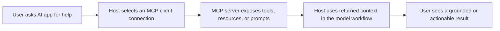

# how-mcp-works

An open source educational project that explains the Model Context Protocol (MCP) from first principles through visual documentation, interactive walkthroughs, and a compact local AI demo.

This repository is organized around three learner questions:

- What is MCP?
- Why do we need MCP?
- How is MCP implemented in practice?

It combines:

- visual-first documentation for MCP concepts and architecture
- a small PyTorch GPT-style model trained on an MCP learning corpus
- a Streamlit application for interactive step-by-step exploration
- beginner-friendly code intended for study, extension, and contribution

This README follows an OSPO-style structure inspired by mature FINOS project documentation, with explicit sections for scope, usage, contribution, governance, security, and support.

## Project Status

Status: Active

Stage: Educational / community-maintained

This is an educational repository, not an official MCP SDK, server framework, or compliance reference. It is designed to help learners understand the shape of MCP systems and the reasoning behind the protocol.

## Objective

The objective of this project is to make MCP understandable to engineers, students, and technical teams by presenting it as a visual interactive system rather than a dense specification alone.

The project explains:

- what MCP is as an open protocol for connecting AI applications to external context and capabilities
- why MCP is needed when models must work with tools, resources, prompts, and real systems
- how MCP is implemented through hosts, clients, servers, transports, capability negotiation, and request flows

## Why This Project Exists

MCP becomes much easier to understand when learners can see the moving parts together:

- the host application
- the MCP client connection
- the MCP server
- the exposed tools, resources, and prompts
- the request and response lifecycle

This project tries to bridge the gap between conceptual explanations and working intuition.

## Scope

The repository currently focuses on:

- the purpose of MCP
- host, client, and server roles
- tools, resources, and prompts
- transport and session lifecycle concepts
- why standardization matters for agentic systems
- visual step-by-step implementation walkthroughs

The repository does not attempt to provide:

- the full MCP specification text
- production-grade MCP infrastructure
- exhaustive coverage of every protocol revision
- official guidance on security or compliance for all MCP deployments

## Repository Structure

- `src/how_mcp_works/`
  Core Python package with configuration, tokenizer, dataset utilities, model, training loop, and inference helpers.
- `scripts/`
  Command-line entry points for preparing data, training the model, and generating text.
- `docs/`
  Visual-first documentation and Mermaid diagrams for MCP concepts.
- `data/`
  Educational training corpus and structured example scenarios.
- `tests/`
  Smoke tests for tokenizer and model behavior.
- `streamlit_app.py`
  Interactive application for exploring MCP concepts and implementation steps.

## Getting Started

### Prerequisites

- Python 3.10 or later
- `pip`
- A local environment capable of installing `torch`, `streamlit`, and `matplotlib`

### Installation

```bash
python -m venv .venv
.venv\Scripts\activate
pip install -e .[dev]
```

### Prepare Data

```bash
python -m scripts.prepare_data
```

### Train

```bash
python -m scripts.train --steps 300 --eval-interval 50
```

Training writes artifacts to `artifacts/`, including a checkpoint and metrics summary.

### Generate MCP Explanations

```bash
python -m scripts.generate --prompt "what is mcp: " --max-new-tokens 120
```

### Run the Interactive UI

```bash
streamlit run streamlit_app.py
```

## Documentation

Start here:

1. [docs/01-first-principles.md](docs/01-first-principles.md)
2. [docs/02-model-architecture.md](docs/02-model-architecture.md)
3. [docs/03-training-and-inference.md](docs/03-training-and-inference.md)

These documents are organized around what MCP is, why it matters, and how implementation flows work.

## Example Learning Scenarios

- An AI IDE needs a standard way to call a filesystem server.
- A host application connects to multiple MCP servers without custom integration logic per server.
- A team wants to expose internal documentation as MCP resources.
- A tool server exposes actions like search, file read, or query execution.
- A client and server negotiate capabilities before exchanging context.

## Architecture Overview



## Intended Audience

This project is useful for:

- developers learning MCP for the first time
- teams evaluating AI integration architecture
- technical educators
- students exploring tool-using AI systems

## Roadmap

Current improvement areas include:

- richer MCP flow visualizations
- stronger scenario coverage for tools, resources, and prompts
- optional mock protocol traces in the UI
- stronger tests and packaging hygiene

Proposals and pull requests are welcome.

## Contributing

Contributions of code, documentation, issues, examples, and corrections are welcome.

Before contributing:

1. Search existing issues and pull requests.
2. Open an issue for substantial changes.
3. Keep pull requests focused and easy to review.
4. Add or update tests when behavior changes.
5. Use sign-offs in commit messages where possible.

See [CONTRIBUTING.md](CONTRIBUTING.md) for the full contribution process.

## Governance

This project follows a lightweight governance-by-contribution model inspired by common FINOS practices:

- maintainers review and merge changes in the open
- decisions should be discussed transparently in issues and pull requests
- contributors can grow into broader responsibility through sustained contribution

See [GOVERNANCE.md](GOVERNANCE.md) for details.

## Security

If you discover a security issue, please do not disclose it publicly in an issue first.

See [SECURITY.md](SECURITY.md) for the reporting process.

## Support

For questions, bug reports, and enhancement requests:

- open a GitHub issue
- use discussions if enabled
- propose improvements through pull requests

Additional support expectations are documented in [SUPPORT.md](SUPPORT.md).

## Code of Conduct

We are committed to a respectful, welcoming, and professional open source community.

See [CODE_OF_CONDUCT.md](CODE_OF_CONDUCT.md).

## License

This repository is released under the MIT License. See [LICENSE](LICENSE).

## Acknowledgements

This repository is not an official MCP project. The explanation in this repo is informed by the public Model Context Protocol documentation and uses an OSPO-style presentation pattern inspired by public FINOS project materials.

