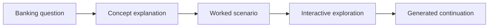

# how-mcp-works

An open source educational project for learning the fundamentals of banking through interactive documentation, scenario-based examples, and a compact local AI demo.

This repository combines:

- visual-first documentation for core banking concepts
- a small PyTorch GPT-style model trained on a banking learning corpus
- a Streamlit application for exploring concepts, prompts, and worked scenarios
- beginner-friendly code intended for study, extension, and contribution

This README is structured in the style commonly seen in mature FINOS projects and OSPO-managed repositories, with clear guidance on project scope, usage, contribution, governance, security, and community expectations.

## Project Status

Status: Active

Stage: Educational / community-maintained

This is an educational repository, not a production banking platform, accounting system, or regulated financial service. It is designed to help learners understand core banking ideas such as deposits, loans, interest, liquidity, and payment flows.

## Why This Project Exists

Banking is often taught either too abstractly or too operationally. This project tries to bridge that gap by combining:

- first-principles explanations
- concrete customer and bank scenarios
- runnable code that learners can inspect and modify
- an interactive UI for experimentation

The goal is to make banking concepts easier to understand without requiring prior domain expertise.

## Scope

The repository currently covers:

- checking and savings accounts
- deposits and withdrawals
- interest and repayment
- loans and credit risk
- liquidity and reserves
- payment flow scenarios

The repository does not attempt to provide:

- financial advice
- regulatory interpretation
- accounting or treasury controls for real institutions
- production-grade model quality for business use

## Repository Structure

- `src/how_mcp_works/`
  Core Python package with configuration, tokenizer, dataset utilities, model, training loop, and inference helpers.
- `scripts/`
  Command-line entry points for preparing data, training the model, and generating text.
- `docs/`
  Visual-first documentation and Mermaid diagrams for banking concepts.
- `data/`
  Educational training corpus and structured example scenarios.
- `tests/`
  Smoke tests for tokenizer and model behavior.
- `streamlit_app.py`
  Interactive application for exploring banking concepts and generated explanations.

## Getting Started

### Prerequisites

- Python 3.10 or later
- `pip`
- A local environment capable of installing `torch`, `streamlit`, and `matplotlib`

### Installation

```bash
python -m venv .venv
.venv\Scripts\activate
pip install -e .[dev]
```

### Prepare Data

```bash
python -m scripts.prepare_data
```

### Train

```bash
python -m scripts.train --steps 300 --eval-interval 50
```

Training writes artifacts to `artifacts/`, including a checkpoint and metrics summary.

### Generate Banking Explanations

```bash
python -m scripts.generate --prompt "banking concept: savings account" --max-new-tokens 120
```

### Run the Interactive UI

```bash
streamlit run streamlit_app.py
```

## Documentation

Start here:

1. [docs/01-first-principles.md](docs/01-first-principles.md)
2. [docs/02-model-architecture.md](docs/02-model-architecture.md)
3. [docs/03-training-and-inference.md](docs/03-training-and-inference.md)

These documents explain the domain concepts first and the implementation second.

## Example Learning Scenarios

- A customer receives salary into a checking account and uses it for bills and daily spending.
- A customer builds an emergency fund in a savings account.
- A borrower applies for a car loan and the bank evaluates risk.
- A bank experiences a high-withdrawal day and must manage liquidity.
- A debit card purchase moves funds through the payment system.

## Architecture Overview



## Intended Audience

This project is useful for:

- students and self-learners
- internal training teams
- developer advocates and technical educators
- engineers interested in financial domain onboarding

## Roadmap

Current improvement areas include:

- richer banking scenario coverage
- clearer balance-sheet visualizations
- stronger tests and packaging hygiene
- optional structured lessons beyond text generation

Proposals and pull requests are welcome.

## Contributing

Contributions of code, documentation, issues, examples, and corrections are welcome.

Before contributing:

1. Search existing issues and pull requests.
2. Open an issue for substantial changes.
3. Keep pull requests focused and easy to review.
4. Add or update tests when behavior changes.
5. Use sign-offs in commit messages where possible.

See [CONTRIBUTING.md](CONTRIBUTING.md) for the full contribution process.

## Governance

This project follows a lightweight governance-by-contribution model inspired by common FINOS practices:

- maintainers review and merge changes in the open
- decisions should be discussed transparently in issues and pull requests
- contributors can grow into broader responsibility through sustained contribution

See [GOVERNANCE.md](GOVERNANCE.md) for details.

## Security

If you discover a security issue, please do not disclose it publicly in an issue first.

See [SECURITY.md](SECURITY.md) for the reporting process.

## Support

For questions, bug reports, and enhancement requests:

- open a GitHub issue
- use discussions if enabled
- propose improvements through pull requests

Additional support expectations are documented in [SUPPORT.md](SUPPORT.md).

## Code of Conduct

We are committed to a respectful, welcoming, and professional open source community.

See [CODE_OF_CONDUCT.md](CODE_OF_CONDUCT.md).

## License

This repository is released under the MIT License. See [LICENSE](LICENSE).

## Acknowledgements

This repository is not a FINOS-hosted project. Its README structure and open source hygiene were shaped using public FINOS governance and community materials as reference points for OSPO-style project presentation.

