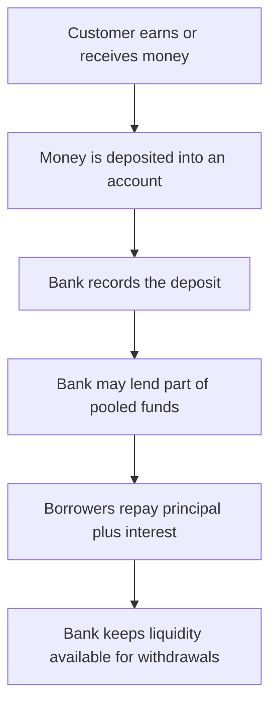

# First Principles

This project explains the fundamentals of banking from first principles, using simple language and realistic customer situations.

## Big Idea

At a high level, banking is about helping people store money, move money, and borrow money while managing risk.

The main beginner concepts connect like this:

- accounts hold customer balances
- payments move balances between parties
- loans provide money now in exchange for future repayment
- interest prices time and risk
- reserves and liquidity help banks meet withdrawals

## The Core Banking Loop

## Four Questions That Explain Most Banking Basics

When learners get confused, these questions usually unlock the topic:

1. Who owns the money right now?
2. What promise has been made?
3. What risk is each side taking?
4. How does the bank stay liquid and profitable?

## Customer View vs Bank View

The same event can look different depending on perspective.

- Customer view: "My money is sitting safely in the bank."
- Bank view: "That deposit is a liability because we owe it back to the customer."

That shift in perspective is one of the most important first-principles ideas in banking.

## Mental Model

You can think of banking as four linked layers:

1. Accounts store balances
2. Payment rails move balances
3. Loans create repayment obligations
4. Risk controls keep the system stable

## In This Repo

The docs explain the domain concepts, and the code plus Streamlit app let you explore those concepts through generated explanations and worked scenarios.
