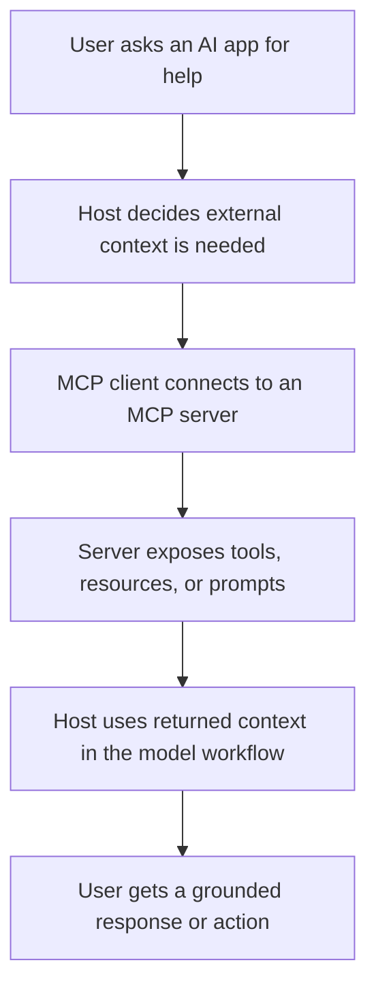

# First Principles

This project explains the Model Context Protocol from first principles, using simple language and visual mental models.

## Big Idea

MCP is an open protocol for connecting AI applications to external context and capabilities in a standard way.

At a high level, MCP helps an AI application stop being isolated from the systems around it.

The main beginner concepts connect like this:

- a host application wants to use external context
- an MCP client maintains a connection to an MCP server
- the MCP server exposes tools, resources, or prompts
- the host uses that information inside the AI workflow

## What MCP Is

## Why MCP Is Needed

Without a common protocol, every AI application would need custom one-off integrations for every external system.

MCP helps because it gives the ecosystem a shared contract for:

1. discovering capabilities
2. negotiating what each side supports
3. exchanging requests and responses consistently
4. letting one host work with many servers without bespoke glue code each time

## The Three Most Important Roles

- Host: the AI application coordinating the experience
- Client: the connection component created by the host for one server
- Server: the program exposing context or actions

One host can talk to many servers, but each client-server connection is typically one-to-one.

## Mental Model

You can think of MCP as a standard plug layer between AI apps and external systems.

- The host is the application the user sees
- The server is the capability provider
- The protocol is the shared language between them

## In This Repo

The docs explain what MCP is, why it matters, and how implementation works. The Streamlit app lets you step through those ideas visually and interactively.
