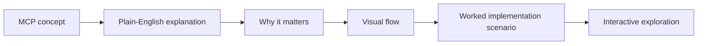

# Model Architecture

This repository uses a tiny decoder-only transformer as an educational engine, but the learner-facing structure is organized around MCP concepts rather than model internals.

## MCP Learning Architecture

## The Core MCP Building Blocks

Every beginner lesson in this repo maps back to a few durable ideas:

1. Hosts
2. Clients
3. Servers
4. Tools
5. Resources
6. Prompts
7. Lifecycle and capability negotiation

## Why Standardization Matters

Without MCP, each AI app and each external system would need custom integration logic.

With MCP, a host can use the same protocol shape across different servers. That reduces integration complexity and improves portability.

## Why Scenario Learning Helps

Beginners usually learn MCP faster when each concept is attached to a concrete workflow:

- an IDE reading local files through an MCP server
- an assistant calling a search tool through an MCP server
- a client discovering available prompts from a server
- a host negotiating capabilities before starting work

That is why the Streamlit app combines generated explanations with scenario cards and flow diagrams.

## Technical Note

The Python implementation still includes:

- multi-head attention
- residual connections
- pre-layer normalization
- dropout
- autoregressive generation

These parts support the generator, while the visible lesson structure stays MCP-first.
