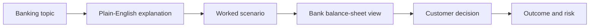

# Model Architecture

This repository uses a tiny decoder-only transformer as an educational engine, but the learning experience is organized around banking fundamentals rather than model internals.

## Banking Concept Architecture

## The Core Banking Building Blocks

Every beginner lesson in this repo maps back to a few durable ideas:

1. Deposits
2. Accounts
3. Payments
4. Loans
5. Interest
6. Risk management

## Balance-Sheet Intuition

One of the cleanest ways to understand banking is to separate assets from liabilities:

- customer deposits are liabilities
- loans are assets
- cash and reserves are assets
- capital provides a cushion against losses

## Why Scenario Learning Helps

Beginners usually learn banking faster when a concept is attached to a concrete everyday case:

- salary deposit into checking
- emergency fund in savings
- car loan application
- card payment at a store
- heavy withdrawal day and liquidity pressure

That is why the Streamlit app combines text generation with scenario cards.

## Technical Note

The Python implementation still includes:

- multi-head attention
- residual connections
- pre-layer normalization
- dropout
- autoregressive generation

These parts support the generator, while the visible lesson structure stays banking-first.
