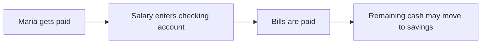
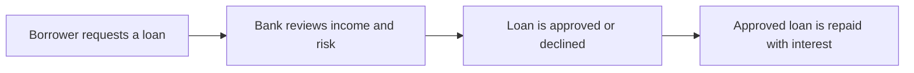

# Training And Inference

## Banking Topic Coverage

The bundled dataset is intentionally small, but it covers the beginner banking concepts most people need first:

- checking and savings accounts
- deposits and withdrawals
- interest and repayment
- loans and credit risk
- liquidity and reserves
- payment flows

## Example Scenarios

## Generation Pipeline

## What To Explore In The App

- Try prompts like `banking concept: interest`
- Try prompts like `scenario: a customer compares checking and savings`
- Compare low-temperature and high-temperature outputs
- Inspect the next-token probabilities to see how the explanation is formed
