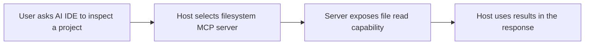
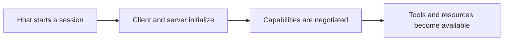
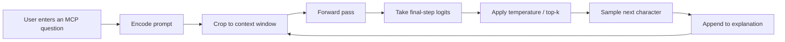

# Training And Inference

## MCP Topic Coverage

The bundled dataset is intentionally small, but it covers the beginner MCP concepts most people need first:

- what MCP is
- why standardization helps
- host, client, and server roles
- tools, resources, and prompts
- lifecycle and capability negotiation
- request and response flow intuition

## Example Scenarios

## Generation Pipeline

## What To Explore In The App

- Try prompts like `what is mcp: `
- Try prompts like `why mcp: `
- Try prompts like `how mcp works: `
- Compare low-temperature and high-temperature outputs
- Inspect the next-token probabilities to see how the explanation is formed
